# 🛸 The Bard's Tale VR (WebXR / Three.js)

[](LICENSE)
[](https://immersiveweb.dev/)
[](https://threejs.org/)
[](https://vitejs.dev/)
[](src/)

> An immersive WebXR 3D virtual reality adaptation of the legendary 1985 Commodore 64 CRPG **"The Bard's Tale: Tales of the Unknown • Volume I"**, built using modular Three.js spatial computing architecture with dual WebXR 6DOF VR + Desktop browser fallback.

---

## 🌟 Overview & Experience Flow

Step into the world of 1985 Skara Brae in virtual reality. The journey begins at a nostalgic 1980s wood-paneled bedroom desk with a Commodore 64 and 1541 disk drive, then pulls you through a dimensional vortex monitor into the living medieval city of Skara Brae.

```mermaid
flowchart LR
    A["💻 1980s Retro C64 Desk"] -->|"LOAD 'Louis F Ham presents',8,1"| B["🌌 Dimensional Vortex Portal"]
    B -->|"360° Barrel Roll Transition"| C["🍺 Skara Brae Tavern"]
    C -->|"Assemble 6-Hero Party"| D["🛡️ Garth's Weapons & Wonders"]
    D -->|"Exit Door / Streets"| E["🏰 Skara Brae 30x30 City Grid"]
    E -->|"Encounter / Action"| F["⚔️ 3D Spatial Combat Arena"]
    F -->|"Victory / Level Up"| G["📜 Review Board & Temples"]
    G --> E
```



---

## 🎮 What Is Implemented & Verified (100% Functional)

### 1. 💻 1980s Retro C64 Desk & Intro Cinematic Sequence (`src/world/retro-room/RetroRoom.js`)
- **Realistic 1980s Bedroom**: Dark wood-paneled walls, ceiling fan fixture, 1980s pop culture posters, desk clutter (8-way red ball-top joystick, soda cans, pencil mug, clue book).
- **Physical Commodore 64 & 1541 Disk Drive**: Authentic C64 case, keyboard with PETSCII key legends, drive cooling vents, rotating latch lever, and flickering red drive activity LED.
- **Curved Commodore 1702 CRT Monitor**: Real-time GLSL shader (`src/shaders/CRTMonitorShader.js`) with barrel tube distortion, scanlines, phosphor mask, and bloom.
- **On-Rails Cinematic Intro**:
  - Starts aligned with the desk at the back of the bedroom ($z = 2.4\text{m}$, $y = 1.18\text{m}$).
  - Dollies smoothly to the desk ($z = 0.15\text{m}$).
  - Camera tilts down to watch the 5¼" floppy disk labeled *"The Bard's Tale VR"* slide into the 1541 disk drive.
  - Camera tilts up to watch the Commodore 64 boot sequence (`LOAD "Louis F Ham presents",8,1` ➔ `SEARCHING` ➔ `LOADING` ➔ `READY. RUN` ➔ Full Title Screen).
  - Swirling GLSL logarithmic vortex portal activates, 3D particle vortex disk spins up, sucking the player into the screen with a **360° perspective barrel roll** and fade to black.

### 2. 🍺 Skara Brae Tavern (`src/world/FullVRTavern.js`)
- **Atmospheric Medieval Tavern**: Packed sand/dirt floor with bump normal maps, timber ceiling beams, iron wagon-wheel chandelier, and crackling stone hearth.
- **Live Stage Bard Performer (`src/audio/BardSinger.js` & `BardSynth.js`)**: Real-time Web Audio API procedural lute synthesizer + vocal formant oscillator performing *"The Evil in Skara Brae"* with 3D floating lyric speech bubbles.
- **3D Seated Patrons**: Human Paladin, Elf Wizard, Dwarf Warrior, and Hobbit Rogue seated around oak slab tables with interactive sloshing ale tankards.
- **Dimensional Entrance Transition**: Concentric golden/violet dimensional rift ripple expanding and dissolving upon entry.
- **Interactive Exit Door**: Glowing golden highlight frame and large doorway trigger box; opens upon highlight + **ANY button press** on Meta Quest 2/3 Touch controllers.

### 3. 🛡️ Garth's Weapons & Wonders (`src/world/garths-shop/GarthsShop.js`)
- **Equipment Shoppe Environment**: Stone walls, volumetric wall torches, Garth shopkeeper NPC, crossed display blades, and shop banner.
- **3D Modeled Counter Weapons**: Physical Broadswords, Battleaxes, Iron Shields, Oak Staves, Warhammers, and Daggers that can be grabbed or tapped to equip directly to party hero slots.
- **Auto-Equip Station**: Golden anvil station to instantly kit out the entire 6-hero party with mid-grade arms, armor, and exploration torches.
- **Ledger & Character Inspection**: Interactive parchment ledger to inspect party character sheets and equipment.

### 4. 📖 Palm-Flip 3D Grimoire / Player Book (`src/ui/spatial-hud/PalmBookMenu.js`)
- **Natural Palm Gesture Tracking**: Turning hand over from palm-down to palm-up summons the glowing Grimoire with a summoning animation; dropping the pose dispels it.
- **Dual VR Controller Button Support**: Pressing **Y** or **X** on the left Touch controller toggles the Grimoire in HUD mode.
- **Page 1 (Heroes & Inspection)**: 6-hero status cards + detailed inspection view with dynamic condition portraits (*POISONED green tint & skull, CURSED purple shadow aura, DAMAGED blood splatters*).
- **Page 2 (Diegetic Automap)**: Real-time map generator rendering explored grid tiles, landmarks (*Tavern, Garth's Shop, Guild, Temples, Review Board, Roscoe's*), with fog-of-war.
- **Page 3 (Spells & Live Testing)**: Live testing of spells outside combat (*Mage Flame dual hand fire emitters, Air Armor 6-inch amber shield bubble, Vorpal Plating electrical sparks*).
- **C64 Desk Quick Reset**: Instant reset button to jump back to the 1985 C64 desk.

### 5. 🏰 Canonical 30×30 Skara Brae City Grid (`src/world/skara-brae/SkaraBraeStreetScene.js`)
- **Full 30×30 Map**: Complete city grid matching the original 1985 Interplay map with cobblestone streets, dynamic sky dome, and authentic C64 pixel art building facades.
- **Interactive Storefronts & Sanctuaries**:
  - **Adventurers Guild & Tavern**: Safe havens to rest and advance time to morning.
  - **Temple of Divine Light & Temple of Tarjan (`src/ui/TempleUI.js`)**: Healing, purification, and resurrection services (100% free for Rogues at Tarjan).
  - **Review Board (`src/ui/ReviewBoardUI.js`)**: Character level-ups, attribute rolls, spell tier training, and class changes (*Conjurer/Magician ➔ Sorcerer ➔ Wizard*).
  - **Roscoe's Energy Emporium (`src/ui/RoscoeUI.js`)**: Spell Point recharges for 15 GP/SP.

### 6. ☀️🌙 Canonical Day / Night Cycle (`src/core/time/WorldTimeEngine.js`)
- **Continuous World Clock**: Cycles through `DAY` (3 min) ➔ `DUSK` (30s) ➔ `NIGHT` (2.5 min) ➔ `DAWN` (20s).
- **Service Hours**: Garth's Shop and the Review Board shutter at night.
- **Natural SP Regeneration**: Mages recover +1 SP per tick during daytime; stops at night.
- **Nighttime Street Danger**: Day spawns 1 enemy group; Night spawns 1–4 dangerous monster groups.

### 7. ⚔️ Dedicated 3D Spatial Combat Arena (`src/world/combat-zone/CombatArena.js`)
- **Tactical 3D Arena**: Rune-inscribed arena floor, glowing braziers, spatial party formation (front row melee vs back row caster), and 3D monster groups.
- **Scrolling Combat Log**: Classic CRPG battle text log (*"You face death in the form of 4 Skeletons!"*).
- **Hero Formation Swap**: Tap hero to make them turn head quizzically, tap second hero to swap battle order.
- **CRPG Mechanics (`src/core/combat/CombatEngine.js`)**: AC mitigation, d20 hit rolls, 4-action monster AI slots, on-hit status afflictions, breath attacks, and survivor XP splits.

### 8. 🏃 Locomotion & Physics (`src/xr/FreeLocomotion.js`)
- **Calibrated Avatar Height**: Desktop fallback eye height locked at **`1.18m`**; WebXR 6DOF VR rig locked at **`0.0m`** so room-scale physical head height is natural.
- **Rolling Office Chair Gesture Locomotion**: Raising arm and forming a fist propels the player forward with gradual acceleration and caster drag friction. Moving the arm left/right spins the avatar while preserving momentum.
- **2D Bumper Car Collisions**: Planar elastic bounce off walls, furniture, and counters with VR haptics.
- **Controller Thumbstick & WASD**: Standard smooth locomotion and snap/smooth turning.

---

## 🚧 What Is Not Yet Implemented (Roadmap & Future Milestones)

- [ ] **Dungeon Levels**: Subterranean stairs leading down into *The Wine Cellar*, *The Catacombs (Levels 1–3)*, *Harkyn's Castle*, *Kylearan's Tower*, and *Mangar's Tower*.
- [ ] **Dungeon Traps & Hazards**: Spinner tiles, darkness anti-magic zones, pit traps, and teleporters.
- [ ] **3D Spatial Rune Drawing Gestures**: VR controller motion tracking for drawing spell runes in 3D space to trigger specific 4-letter spell codes.
- [ ] **Dynamic Gold Purchase Economy**: Real-time deduction of gold pieces when purchasing individual items off Garth's counter or ordering drinks from the Tavern barkeep.
- [ ] **Positional Ambient Soundscapes**: 3D spatial audio for crackling fireplace logs, distant howling wind at night, and tavern crowd murmurs.

---

## 🕹️ Controls & Interaction Guide

### 🥽 WebXR VR Mode (Meta Quest 2 / 3 / Pro / Android XR)
| Action | Gesture / Controller Input |
|---|---|
| **Interact / Select** | Raycast Point + **Trigger** or **Grip** |
| **Open Tavern Door** | Highlight Door (Raycast or Proximity $\le 2.6\text{m}$) + **ANY Button** (`A`, `B`, `X`, `Y`, `Trigger`, `Grip`, `Thumbstick`) |
| **Summon / Dismiss Grimoire** | Turn hand **Palm-UP** (Summon) / **Palm-DOWN** (Dismiss) |
| **Toggle Grimoire (Buttons)** | Press **Y** or **X** on Left Touch Controller |
| **Office Chair Locomotion** | Raise arm forward + close into **Fist** (accelerates forward) |
| **Steer Office Chair** | Move raised fist **Left** (Spin CCW) or **Right** (Spin CW) |
| **Standard Movement** | **Left Thumbstick** (Move) • **Right Thumbstick** (Turn) |

### 🖥️ Desktop Browser Fallback (Mouse & Keyboard / Gamepad)
| Action | Key / Input |
|---|---|
| **Move** | `W`, `A`, `S`, `D` or Arrow Keys |
| **Turn Left / Right** | `Q` / `E` or Mouse Orbit Drag |
| **Interact / Click** | **Left Click** or **[A]** on Gamepad |
| **Toggle Grimoire / Automap** | `M` or `Tab` or **[Y]** / **[SELECT]** on Gamepad |
| **Inspect Character Cards** | `C` or `I` |
| **Advance Day / Night Phase** | `N` |
| **Quick Restart to C64 Desk** | `R` |
| **Cycle Book Pages / Commands** | `1`, `2`, `3` or `LB` / `RB` on Gamepad |
| **Fist Push Simulation** | Hold `Space` or `F` |

---

## 🚀 Getting Started & Local Development

### 📋 Prerequisites
- **Node.js**: Version `18.0.0` or higher ([Download Node.js](https://nodejs.org/))
- **npm**: Version `9.0.0` or higher (bundled with Node.js)
- **WebXR Compatible Browser**:
  - Meta Quest Browser (Meta Quest 2 / 3 / Pro)
  - Google Chrome / Edge on Desktop (with WebXR emulator extension or fallback mode)
  - Android Chrome on Android XR

### 1. Clone the Repository
```bash
git clone https://github.com/louisjham/bardstalevrnew.git
cd bardstalevrnew
```

### 2. Install Dependencies
```bash
npm install
```

### 3. Start the HTTPS Development Server
> **Important**: WebXR requires an **HTTPS** connection (or `localhost`) to access device sensors, controllers, and VR presentation modes. The project includes `@vitejs/plugin-basic-ssl` for automated local SSL certificates.

```bash
npm run dev
```

The terminal will display the local and network URLs:
```
  ➜  Local:   https://localhost:5173/
  ➜  Network: https://192.168.1.X:5173/
```

### 4. Running on a Meta Quest Headset
1. Ensure your Meta Quest headset is connected to the same Wi-Fi network as your computer.
2. Note your computer's local IP address from the Vite output (e.g. `https://192.168.1.X:5173/`).
3. Open the **Meta Quest Browser** inside the headset.
4. Navigate to `https://192.168.1.X:5173/`.
5. If prompted with an SSL certificate warning (*self-signed dev certificate*), click **Advanced** ➔ **Proceed to site**.
6. Click the glowing **"ENTER VR"** button at the bottom of the screen.

### 5. Running Automated Unit Tests
The project features a 30-test suite verifying the combat engine, XP tables, character conditions, encounter generation, spell database, and locomotion kinematics:

```bash
npm test
# or directly with Node.js:
node --test src/**/*.test.js
```

### 6. Production Build
```bash
npm run build
npm run preview
```

---

## 📁 Codebase Architecture

```
TheBardsTaleVR/
├── .agents/skills/          # AI pair programming guidelines & XR Blocks patterns
├── research/                # C64 D64 binary analyzer, disassembly notes & tables
├── src/
│   ├── agents/              # Game Director AI encounter & pacing coordinator
│   ├── audio/               # Web Audio API BardSynth (lute synth) & BardSinger
│   ├── core/
│   │   ├── combat/          # CRPG turn engine, AC calculations, d20 hit rolls
│   │   ├── conditions/      # 8 canonical character status bytes & modifiers
│   │   ├── encounter/       # Zone- and time-driven encounter generator
│   │   ├── game-loop/       # 5-location game state machine
│   │   ├── recovery/        # Temple healing & status recovery system
│   │   ├── review-board/    # XP tables, level advancement & class promotion
│   │   └── time/            # Authentic Day / Night World Time Engine
│   ├── data/                # Monster bestiary, items, spell database, 30x30 map
│   ├── shaders/             # CRT Monitor, Vortex Portal, and Torch Flame GLSL
│   ├── textures/            # Canvas PBR bump maps (sand floor, wood, C64 cases)
│   ├── ui/
│   │   ├── spatial-hud/     # Palm-Flip 3D Grimoire & tutorial window
│   │   ├── debug/           # Developer sandbox & grid inspector panels
│   │   ├── CharacterCardUI.js
│   │   ├── PartyCreationUI.js
│   │   ├── ReviewBoardUI.js
│   │   ├── RoscoeUI.js
│   │   └── TempleUI.js
│   ├── world/
│   │   ├── combat-zone/     # 3D spatial battle room & scrolling battle log
│   │   ├── garths-shop/     # Garth's Weapons & Wonders equipment room
│   │   ├── retro-room/      # 1980s bedroom with C64, 1541 drive & CRT monitor
│   │   ├── skara-brae/      # 30x30 Canonical City Grid & street scene
│   │   └── FullVRTavern.js  # Skara Brae Tavern & performance stage
│   ├── xr/
│   │   ├── FreeLocomotion.js # Office chair kinematics & 2D bumper collisions
│   │   ├── GamepadManager.js # Xbox/PS4/Generic standard gamepad driver
│   │   ├── XRManager.js      # WebXR Device API, controller rays & haptics
│   │   └── XRRig.js          # Decoupled camera rig group for 6DOF VR
│   ├── main.js              # Application entry point & orchestration
│   └── style.css            # Dark fantasy glassmorphism UI styling
├── index.html
├── package.json
└── vite.config.js
```

---

## 📜 Credits & Acknowledgments
- **Original Game**: *"The Bard's Tale: Tales of the Unknown • Volume I"* (1985) by Michael Cranford / Interplay Productions & Electronic Arts.
- **Engine**: Three.js & WebXR Device API.
- **Audio Synthesis**: Procedural Web Audio API sound synthesis.
