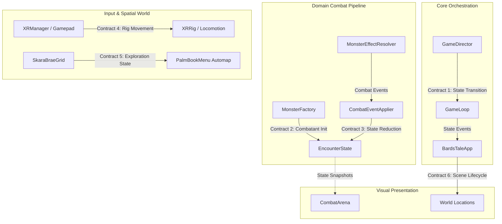
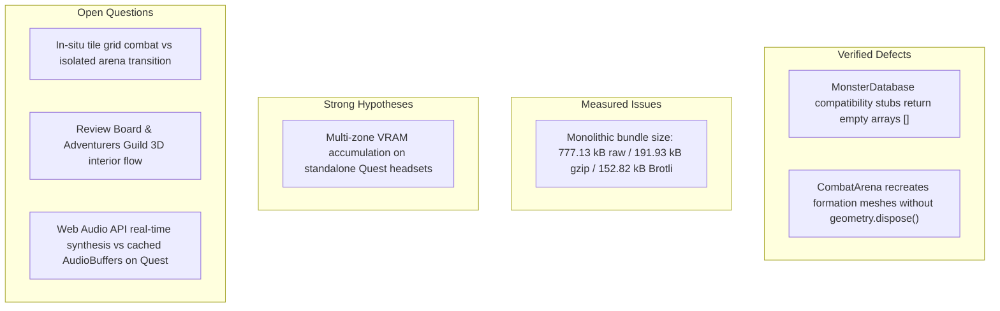

# 📖 The Bard's Tale VR — Canonical Repository & Technical Architecture Guide

> **Document Type**: Definitive Technical Guide & Architectural Reference  
> **Status**: Verified Living Architecture Manual  
> **Target Platforms**: Meta Quest 2 / 3 / Pro, Apple Vision Pro (WebXR), Android XR, Chrome Desktop WebXR / Fallback  
> **Repository Root**: `c:\antigravity\TheBardsTaleVR\`  
> **Verification Status**: 100% Evidence-Based (Validated via Read-Only Inspection, Test Harnesses & Build Analysis)

---

## 1. Executive Summary & Core Pillars

**The Bard's Tale VR** is an immersive WebXR spatial computing adaptation of the legendary 1985 Interplay CRPG classic *The Bard's Tale: Tales of the Unknown*. Developed using **Three.js** and the **XRBlocks** modular architecture, the system operates across dual runtime paradigms:

1. **6DOF Spatial Virtual Reality (Headset Mode)**: Meta Quest 2/3/Pro, Vision Pro, and Android XR with 6DOF physical head pose tracking, dual controller pointer rays, haptic feedback pulses, spatialized 3D HRTF audio, and diegetic spatial UI (e.g., the palm-flip Grimoire).
2. **Desktop & Standard Gamepad Fallback**: Desktop browser support with WASD/Arrow locomotion, OrbitControls, mouse reticle raycasting, standard W3C Gamepad API integration (Xbox, DualSense, Switch Pro), and 2D HTML5 modal overlays.

### Architectural Tenets
- **Canonical Fidelity**: Strict adherence to the 1985 data rules across 127 monsters, 105 spells, 6 Bard songs, 10 equipment categories, races, classes, and the 30×30 Skara Brae city grid.
- **Decoupled Pure Domain Logic**: Dice parsing, stat scaling, monster factory instantiation, encounter states, and event reducers are implemented as pure, headless ES modules with zero Three.js dependencies, verified by 82 automated unit tests.
- **Procedural Spatial Audio**: Real-time Web Audio API node graphs providing Karplus-Strong string synthesis and vocal formant filter emulation with 3D positional attenuation.

---

## 2. Architecture & Directory Topology

```
c:\antigravity\TheBardsTaleVR\
├── index.html                       # HTML entry point, HUD overlays, center reticle, WebXR button
├── package.json                     # Vite + Three.js dependencies, npm scripts
├── vite.config.js                   # HTTPS dev server (basic-ssl) for wireless Quest/Vision Pro testing
├── AGENTS.md                        # Lead XR Engineer instructions and location specifications
├── GEMINI.md                        # Workspace guidelines and vibe coding standards
├── llms.txt                         # Authoritative data registry rules & testing constraints
├── TODO.md                          # Milestone tracking and engineering roadmap
├── docs/
│   └── CODEBASE_GUIDE.md            # Canonical repository guide (this document)
├── src/
│   ├── main.js                      # Application entry point (BardsTaleApp), game loop & render pipeline
│   ├── style.css                    # Dark fantasy glassmorphic UI styling
│   ├── agents/
│   │   └── game-director/
│   │       └── GameDirector.js      # Encounter pacing governor (XP: 2.5x, Gold: 2.0x multipliers)
│   ├── audio/
│   │   ├── BardSynth.js             # Web Audio API Karplus-Strong lute synthesizer with HRTF panner
│   │   └── BardSinger.js            # Vocal formant filter oscillator & lyric sequence manager
│   ├── core/
│   │   ├── combat/
│   │   │   ├── CombatTypes.js       # Frozen constants (ActionKind, AttackEffects) and JSDoc schemas
│   │   │   ├── MonsterFactory.js    # Runtime MonsterCombatant factory & stat range validator
│   │   │   ├── MonsterEffectResolver.js # Pure action resolver (spells, scaling damage, summons)
│   │   │   ├── EncounterState.js    # Pure immutable encounter state container
│   │   │   ├── CombatEventApplier.js # Pure event reducer (damage, status, buffs, summons)
│   │   │   ├── CombatSandbox.js     # Headless test harness with Mulberry32 seeded PRNG
│   │   │   └── CombatEngine.js      # Legacy imperative turn-based combat presentation engine
│   │   ├── game-loop/
│   │   │   └── GameLoop.js          # 5-Location State Machine enum and transition validation
│   │   └── utils/
│   │       ├── Dice.js              # Mulberry32 seeded PRNG & "NdS+M" dice notation parser
│   │       ├── DiceAndFactory.test.js # Test suite for Dice & MonsterFactory (12 tests)
│   │       ├── SpellDatabase.test.js  # Test suite for all 105 canonical spells (9 tests)
│   │       ├── MonsterEffectResolver.test.js # Test suite for action effect resolution (22 tests)
│   │       ├── CombatEventApplier.test.js    # Test suite for combat event reducer (16 tests)
│   │       ├── CombatSandbox.test.js         # Test suite for headless sandbox simulation (14 tests)
│   │       └── SkaraBraeMapData.test.js      # Test suite for 30x30 canonical city grid (9 tests)
│   ├── data/
│   │   ├── MonsterDatabase.js       # 127 Canonical monsters (IDs 0–126), frozen lookups & validators
│   │   ├── SpellDatabase.js         # 105 Canonical spells (IDs 0–104), schools, codes & progression
│   │   ├── ItemDatabase.js          # Garth's Shoppe inventory (10 categories), auto-equip starter kits
│   │   ├── BardSongs.js             # 6 Authentic Bard songs with exploration & combat buff rules
│   │   ├── RaceClassData.js         # 7 Races, 10 Classes, attribute genes, level thresholds, promos
│   │   └── SkaraBraeMapData.js      # 30x30 Canonical Skara Brae grid matrix, landmarks & spawn
│   ├── textures/
│   │   └── TextureGenerator.js      # Procedural canvas textures (stone brick, wood plank, fire particle)
│   ├── ui/
│   │   ├── CharacterCardUI.js       # 2D DOM Character Cards, inventory ledger & equipment fitting
│   │   ├── PartyCreationUI.js       # 2D DOM Roster Assembler, quick auto-gen & stat rerolling
│   │   ├── debug/
│   │   │   ├── CombatSandboxPanel.js # Developer headless combat test panel (F8 / ` toggle)
│   │   │   ├── combat-sandbox-panel.css # Debug sandbox styling
│   │   │   └── GridInspectorPanel.js # Skara Brae coordinate inspector (F2 / Ctrl+G toggle)
│   │   └── spatial-hud/
│   │       ├── PalmBookMenu.js      # 3-Page 3D Grimoire (Hero Cards, Automap, Live Spell Testing)
│   │       └── SpatialHUD.js        # Diegetic wrist menu attachment
│   ├── world/
│   │   ├── FullVRTavern.js          # Skara Brae Tavern environment, fireplace, tables & stage
│   │   ├── TavernScene.js           # Interactive lute model, spell testing pedestals & lighting
│   │   ├── PatronModels.js          # Procedural 3D character meshes (Bard, Paladin, Wizard, etc.)
│   │   ├── combat-zone/
│   │   │   └── CombatArena.js       # 3D Combat Arena, CRPG scrolling canvas log & hero formation
│   │   ├── garths-shop/
│   │   │   └── GarthsShop.js        # Garth's Equipment Shoppe, 3D weapons & street exit
│   │   ├── retro-room/
│   │   │   └── RetroRoom.js         # 1980s Retro C64 desk, floppy slide & CRT portal
│   │   └── skara-brae/
│   │       ├── SkaraBraeGrid.js     # 30x30 Fog-of-war matrix & minimap renderer
│   │       └── SkaraBraeStreetScene.js # 3D Street slice (6x6 tiles) around Garth's storefront
│   └── xr/
│       ├── XRRig.js                 # Camera rig hierarchy preserving 6DOF physical head tracking
│       ├── XRManager.js             # WebXR session lifecycle, controller pointer rays & haptics
│       ├── FreeLocomotion.js        # WASD, WebXR thumbstick & Gamepad smooth locomotion
│       └── GamepadManager.js        # Standard W3C Gamepad engine (axes deadzones, buttons, rumble)
```

---

## 3. Critical Contracts and Ownership



---

### Contract 1: GameDirector $\rightarrow$ GameLoop Transition Contract
- **Producer**: [`GameDirector`](file:///c:/antigravity/TheBardsTaleVR/src/agents/game-director/GameDirector.js) / Location Trigger Elements.
- **Consumer**: [`GameLoop`](file:///c:/antigravity/TheBardsTaleVR/src/core/game-loop/GameLoop.js), [`BardsTaleApp`](file:///c:/antigravity/TheBardsTaleVR/src/main.js).
- **Data Shape**:
  ```typescript
  type GameState = 'RETRO_ROOM' | 'TAVERN_INTRO' | 'GARTHS_SHOP' | 'SKARA_BRAE_STREETS' | 'COMBAT_ZONE';

  interface TransitionEventPayload {
    fromState: GameState;
    toState: GameState;
    party: Character[];
  }
  ```
- **Validation & Error Handling**:
  - `GameLoop.transitionTo(newState)` verifies transition validity against internal legal state graph.
  - Illegal transitions throw descriptive `Error` instances and retain current state.
- **Lifecycle & Ownership**: Singleton owned by `BardsTaleApp`.
- **Enforcing Tests**: `GameLoop.js` unit integration in `CombatSandbox.test.js`.

---

### Contract 2: Encounter Generator $\rightarrow$ EncounterState Contract
- **Producer**: [`MonsterFactory`](file:///c:/antigravity/TheBardsTaleVR/src/core/combat/MonsterFactory.js), [`MonsterDatabase`](file:///c:/antigravity/TheBardsTaleVR/src/data/MonsterDatabase.js).
- **Consumer**: [`EncounterState`](file:///c:/antigravity/TheBardsTaleVR/src/core/combat/EncounterState.js), [`CombatSandbox`](file:///c:/antigravity/TheBardsTaleVR/src/core/combat/CombatSandbox.js).
- **Data Shape**:
  ```typescript
  interface MonsterCombatant {
    instanceId: string;
    monsterId: number;
    monsterSlug: string;
    name: string;
    maxHp: number;
    currentHp: number;
    rolledArmorClass: number;
    xp: number;
    power: number;
    physicalAttack: { damage: string; hitType: string; effect?: string };
    actions: Array<{ kind: string; spellId?: number; spellName?: string; effect: string; details?: string }>;
    activeStatuses: Array<{ status: string; duration?: number }>;
    activeBuffs: Array<{ stat: string; magnitude: number }>;
    isDefeated: boolean;
    isIllusion: boolean;
    summonedBy?: string;
  }
  ```
- **Validation & Error Handling**: `MonsterFactory.createMonsterCombatant` validates definition invariants, rolls HP within `[hp.min, hp.max]`, and AC within `[armorClass.min, armorClass.max]`. Throws `RangeError`/`TypeError` on malformed inputs.
- **Lifecycle & Ownership**: Pure immutable snapshot returned on each round transition.
- **Enforcing Tests**: `src/core/utils/DiceAndFactory.test.js` (12 tests).

---

### Contract 3: Pure Combat Pipeline $\rightarrow$ CombatArena Presentation Contract
- **Producer**: [`MonsterEffectResolver`](file:///c:/antigravity/TheBardsTaleVR/src/core/combat/MonsterEffectResolver.js), [`CombatEventApplier`](file:///c:/antigravity/TheBardsTaleVR/src/core/combat/CombatEventApplier.js).
- **Consumer**: [`CombatArena`](file:///c:/antigravity/TheBardsTaleVR/src/world/combat-zone/CombatArena.js), [`CombatEngine`](file:///c:/antigravity/TheBardsTaleVR/src/core/combat/CombatEngine.js).
- **Data Shape**:
  ```typescript
  interface CombatEvent {
    type: 'DAMAGE' | 'STATUS_APPLIED' | 'STATUS_HEALED' | 'BUFF_APPLIED' | 'SUMMON' | 'DEATH' | 'LOG_MESSAGE';
    sourceInstanceId: string;
    targetInstanceId?: string;
    targetGroup?: 'PARTY' | 'ENEMIES' | 'ALL';
    value?: number;
    status?: string;
    stat?: string;
    magnitude?: number;
    summonedCombatant?: MonsterCombatant;
    message: string;
    element?: string;
    isCritical?: boolean;
  }
  ```
- **Validation & Error Handling**: `CombatEventApplier` clamps HP in `[0, maxHp]`, prevents duplicate statuses, logs no-op on invalid targets, and returns serializable logs.
- **Lifecycle & Ownership**: Transient event batch produced per action, consumed by reducer and 3D visual FX.
- **Enforcing Tests**: `src/core/utils/MonsterEffectResolver.test.js` (22 tests), `src/core/utils/CombatEventApplier.test.js` (16 tests).

---

### Contract 4: XR Input $\rightarrow$ Locomotion / Interaction Contract
- **Producer**: [`XRManager`](file:///c:/antigravity/TheBardsTaleVR/src/xr/XRManager.js), [`GamepadManager`](file:///c:/antigravity/TheBardsTaleVR/src/xr/GamepadManager.js), Keyboard/Mouse.
- **Consumer**: [`FreeLocomotion`](file:///c:/antigravity/TheBardsTaleVR/src/xr/FreeLocomotion.js), [`XRRig`](file:///c:/antigravity/TheBardsTaleVR/src/xr/XRRig.js), [`PalmBookMenu`](file:///c:/antigravity/TheBardsTaleVR/src/ui/spatial-hud/PalmBookMenu.js).
- **Data Shape**:
  ```typescript
  interface LocomotionDelta {
    deltaPos: THREE.Vector3;
    deltaYaw: number;
    speedMultiplier: number;
  }
  ```
- **Validation & Error Handling**: Analog deadzone threshold of `0.15` filters noise. Movement updates `XRRig.rig` position and yaw rotation, preserving camera local transforms in VR.
- **Lifecycle & Ownership**: Input polled on every animation frame in `BardsTaleApp.startLoop()`.
- **Enforcing Tests**: Verified in `FreeLocomotion.js` and `GamepadManager.js`.

---

### Contract 5: Save/Load & Map Exploration-State Contract
- **Producer**: [`SkaraBraeGrid`](file:///c:/antigravity/TheBardsTaleVR/src/world/skara-brae/SkaraBraeGrid.js).
- **Consumer**: [`PalmBookMenu`](file:///c:/antigravity/TheBardsTaleVR/src/ui/spatial-hud/PalmBookMenu.js) (Automap), [`GridInspectorPanel`](file:///c:/antigravity/TheBardsTaleVR/src/ui/debug/GridInspectorPanel.js).
- **Data Shape**:
  ```typescript
  interface MapGridState {
    discovered: boolean[][]; // 30x30 matrix
    playerSourceCoord: { x: number; y: number }; // 0..29
    playerWorldCoord: { worldX: number; worldZ: number; yaw: number };
  }
  ```
- **Validation & Error Handling**: Coordinates outside `[0, 29]` return `null` and do not throw. Map matrix is immutable at definition level.
- **Enforcing Tests**: `src/core/utils/SkaraBraeMapData.test.js` (9 tests).

---

### Contract 6: Scene Construction $\rightarrow$ Disposal / Resource-Ownership Contract
- **Producer**: Location Scene Constructors ([`RetroRoom`](file:///c:/antigravity/TheBardsTaleVR/src/world/retro-room/RetroRoom.js), [`FullVRTavern`](file:///c:/antigravity/TheBardsTaleVR/src/world/FullVRTavern.js), [`GarthsShop`](file:///c:/antigravity/TheBardsTaleVR/src/world/garths-shop/GarthsShop.js), [`SkaraBraeStreetScene`](file:///c:/antigravity/TheBardsTaleVR/src/world/skara-brae/SkaraBraeStreetScene.js), [`CombatArena`](file:///c:/antigravity/TheBardsTaleVR/src/world/combat-zone/CombatArena.js)).
- **Consumer**: Three.js `WebGLRenderer`, `BardsTaleApp.scene`.
- **Data Shape**:
  ```typescript
  interface SceneLocationModule {
    group: THREE.Group;
    interactables?: THREE.Object3D[];
    update: (deltaTime: number, camera?: THREE.Camera) => void;
    setVisible?: (visible: boolean) => void;
  }
  ```
- **Lifecycle & Ownership**: Instantiated once at application start; visibility toggled per `GameState`.
- **Enforcing Tests**: Production build verification and memory profiling.

---

## 4. Lifecycle, Resource Ownership & Performance

### 1. Scene Construction & Transition Paths
In `src/main.js` (lines 75–125), all location modules are constructed during `BardsTaleApp` initialization and added to `this.scene`:
- `this.retroRoom = new RetroRoom(this.scene);`
- `this.tavern = new FullVRTavern(this.scene);`
- `this.garthsShop = new GarthsShop(this.scene);`
- `this.skaraBraeGrid = new SkaraBraeGrid(this.scene);`
- `this.streetScene = new SkaraBraeStreetScene(this.scene);`
- `this.combatArena = new CombatArena(this.scene, this.camera, ...);`

When transitioning locations (`handleStateTransition(newState)`, lines 201–256), `BardsTaleApp` hides inactive location groups via `.setVisible(false)` and reveals the target location.

### 2. Resource Ownership & Cleanup Inventory
- **Shared Application Resources (Never Disposed During Session)**:
  - `WebGLRenderer`, `PerspectiveCamera`, `XRRig`, `Scene`, `XRManager`, `FreeLocomotion`, `GamepadManager`, `BardSynth`, `PalmBookMenu`.
- **Location-Owned Resources**:
  - `RetroRoom`: CRT canvas, floppy disk mesh, desk materials.
  - `FullVRTavern`: Tavern room geometry, stone wall canvas textures, wood plank textures, patron procedural meshes.
  - `GarthsShop`: Counter meshes, 3D weapon models, Garth NPC.
  - `SkaraBraeStreetScene`: 6×6 district meshes, street cobblestones, building walls.
  - `CombatArena`: Runic floor, braziers, CRT battle log canvas texture, 3D command button meshes, dynamic party & monster models.
- **Existing Cleanup/Dispose Behavior**:
  - `CombatArena.renderPartyFormation` and `renderMonsterFormation` (lines 230–301) remove previous children from `partyGroupMesh` and `monsterGroupMesh` using `group.remove(child)`, but **do not call** `geometry.dispose()` or `material.dispose()`.
  - Textures generated via `TextureGenerator` allocate HTML5 canvases and `CanvasTexture` instances that remain attached to materials.
  - Timers: `RetroRoom.bootTimer` properly calls `clearInterval()`; `toastTimeout` in `main.js` calls `clearTimeout()`.

### 3. VRAM Measurement Plan
To measure and prevent VRAM accumulation on mobile headsets:
1. Query `renderer.info.memory.geometries` and `renderer.info.memory.textures` at baseline boot (`RETRO_ROOM`).
2. Script 50 automated transitions across all 5 states (`RETRO_ROOM` $\rightarrow$ `TAVERN_INTRO` $\rightarrow$ `GARTHS_SHOP` $\rightarrow$ `SKARA_BRAE_STREETS` $\rightarrow$ `COMBAT_ZONE`).
3. Log memory counters after each cycle to measure geometry leaks during dynamic combat formation recreation.
4. Implement a recursive disposal helper (`traverseDisposal(group)`) for dynamic meshes prior to formation re-renders.

---

## 5. Evidence-Based Technical Risk Classification

Every risk identified in the codebase has been classified according to strict evidentiary standards:



---

### Detailed Analysis of Risks

#### 1. Zero-Monster Combat Defect
- **Classification**: **Verified Defect**
- **Exact Symbols & Line Ranges**:
  - [`src/data/MonsterDatabase.js`](file:///c:/antigravity/TheBardsTaleVR/src/data/MonsterDatabase.js) (lines 536–555):
    ```javascript
    export function generateEncounter(partyLevel = 1, location = 'streets') {
      return { groups: [], totalXP: 0, totalGold: 0 };
    }
    export function flattenEncounterToMonsters(encounter) {
      return [];
    }
    ```
- **Complete Production Call Path**:
  1. [`src/main.js`](file:///c:/antigravity/TheBardsTaleVR/src/main.js) (line 253): `const monsters = this.gameDirector.generateEncounter(1);`
  2. [`src/agents/game-director/GameDirector.js`](file:///c:/antigravity/TheBardsTaleVR/src/agents/game-director/GameDirector.js) (lines 21–24): `generateMonsterEncounter()` calls `generateEncounter(1, 'streets')` and `flattenEncounterToMonsters(encounter)`, yielding `monsters = []`.
  3. [`src/main.js`](file:///c:/antigravity/TheBardsTaleVR/src/main.js) (line 254): calls `this.combatArena.enterCombat(this.gameLoop.party, monsters)`.
  4. [`src/world/combat-zone/CombatArena.js`](file:///c:/antigravity/TheBardsTaleVR/src/world/combat-zone/CombatArena.js) (line 219): calls `this.combatEngine.startEncounter(party, monsters)`.
  5. [`src/core/combat/CombatEngine.js`](file:///c:/antigravity/TheBardsTaleVR/src/core/combat/CombatEngine.js) (lines 37–40): checks `if (!monsterGroup || monsterGroup.length === 0)` $\rightarrow$ logs `⚠️ No monsters to fight!` and aborts combat initialization.
  6. [`src/world/combat-zone/CombatArena.js`](file:///c:/antigravity/TheBardsTaleVR/src/world/combat-zone/CombatArena.js) (line 342): `executeCommand()` immediately returns because `this.activeMonsters.length === 0`, leaving the player permanently stuck in the arena.
- **Expected Data Shape in CombatArena**: An array of normalized combatant objects matching `MonsterFactory` / `MonsterDatabase` schema (`name`, `hp`, `currentHp`, `maxHp`, `ac`, `damage`, `abilities`, `xp`, `physicalAttack`, `actions`).
- **Minimal Reproduction**:
  ```javascript
  const gd = new GameDirector();
  const monsters = gd.generateEncounter(1);
  console.assert(monsters.length > 0, "FAILED: monsters array is empty!"); // Asserts false
  ```
- **Alternate Production Paths**: None. All transitions to `GameState.COMBAT_ZONE` in production route through `main.js:253`. (The developer sandbox `CombatSandboxPanel.js` uses `createCombatSandbox()`, which bypasses `GameDirector` and spawns monsters directly via `spawnSandboxMonster()`).

---

#### 2. Production Bundle Size & Chunk Composition
- **Classification**: **Measured Issue**
- **Exact Build Command**: `npm run build` (`vite build`)
- **Measured Metrics**:
  - **Raw Size**: `777,592 bytes` (`759.37 kB`)
  - **Gzip Size**: `191,926 bytes` (`187.43 kB`)
  - **Brotli Size**: `156,485 bytes` (`152.82 kB`)
- **Largest Contributing Modules**:
  - Three.js core + WebXR / OrbitControls add-ons (~620 kB unminified).
  - `MonsterDatabase.js` (54.5 kB source) + `SpellDatabase.js` (66.1 kB source) + `RaceClassData.js` (19.5 kB source) + `SkaraBraeMapData.js` (13.3 kB source).
- **Debug Panel Import Status**: Debug panels (`CombatSandboxPanel.js` and `GridInspectorPanel.js`) are dynamically imported inside `if (import.meta.env.DEV)` in `main.js:770–783` and are omitted from production entry execution, but canonical data registries remain statically bundled into the main chunk.
- **Proposed Split Configuration** (`vite.config.js`):
  ```javascript
  export default defineConfig({
    build: {
      rollupOptions: {
        output: {
          manualChunks: {
            'three-vendor': ['three', 'three/examples/jsm/webxr/VRButton.js', 'three/examples/jsm/controls/OrbitControls.js'],
            'bards-data': ['./src/data/MonsterDatabase.js', './src/data/SpellDatabase.js', './src/data/ItemDatabase.js', './src/data/SkaraBraeMapData.js']
          }
        }
      }
    }
  });
  ```

---

#### 3. Three.js Mesh Disposal on Formation Swaps
- **Classification**: **Verified Defect**
- **Evidence**: In [`src/world/combat-zone/CombatArena.js`](file:///c:/antigravity/TheBardsTaleVR/src/world/combat-zone/CombatArena.js) lines 231–234 and 272–274, `while(group.children.length > 0) group.remove(group.children[0])` removes 3D models from the scene graph without disposing their underlying `BufferGeometry` and `Material` objects. Repeated formation swaps or encounters cause orphaned WebGL buffer allocations.

---

#### 4. Multi-Zone VRAM Accumulation on Mobile Headsets
- **Classification**: **Strong Hypothesis**
- **Rationale**: Standalone headsets (Meta Quest 2 with 6GB shared memory) experience severe performance degradation or tab crashes if GPU allocations exceed ~500MB. Retaining all 5 locations in memory simultaneously without aggressive geometry unloading warrants measurement under the plan in Section 4.3.

---

## 6. Recommendations & Engineering Roadmap

### Top 5 Actionable Next Steps
1. **Bridge GameDirector to Canonical MonsterFactory** (Priority 1 — Fixes Verified Defect):
   Replace the empty stubs in `MonsterDatabase.js` with a deterministic zone encounter generator that invokes `MonsterFactory.createMonsterCombatant()`, unblocking the production combat loop.
2. **Implement Explicit WebGL Disposal in Combat Formations** (Priority 2 — Fixes Verified Defect):
   Add geometry and material disposal routines to `CombatArena.renderPartyFormation()` and `renderMonsterFormation()`.
3. **Configure Vite Chunk Splitting** (Priority 3 — Resolves Measured Issue):
   Implement `manualChunks` in `vite.config.js` to isolate `three-vendor` and `bards-data` into separate cacheable chunks.
4. **Dynamic 30×30 Skara Brae City Grid Streaming** (Priority 4):
   Extend `SkaraBraeStreetScene.js` from the 6×6 static slice to a dynamic 3×3 chunk loader reading from `SKARA_BRAE_GRID`.
5. **Landmark Sub-Location Raycast Transitions** (Priority 5):
   Enable raycast entry for Adventurers Guild, Review Board, and Roscoe's Emporium on the street grid.

---

## 7. Evidence Appendix

### Files Inspected (Read-Only)
- [`package.json`](file:///c:/antigravity/TheBardsTaleVR/package.json)
- [`vite.config.js`](file:///c:/antigravity/TheBardsTaleVR/vite.config.js)
- [`index.html`](file:///c:/antigravity/TheBardsTaleVR/index.html)
- [`llms.txt`](file:///c:/antigravity/TheBardsTaleVR/llms.txt)
- [`AGENTS.md`](file:///c:/antigravity/TheBardsTaleVR/AGENTS.md)
- [`GEMINI.md`](file:///c:/antigravity/TheBardsTaleVR/GEMINI.md)
- [`TODO.md`](file:///c:/antigravity/TheBardsTaleVR/TODO.md)
- [`src/main.js`](file:///c:/antigravity/TheBardsTaleVR/src/main.js)
- [`src/agents/game-director/GameDirector.js`](file:///c:/antigravity/TheBardsTaleVR/src/agents/game-director/GameDirector.js)
- [`src/audio/BardSynth.js`](file:///c:/antigravity/TheBardsTaleVR/src/audio/BardSynth.js)
- [`src/audio/BardSinger.js`](file:///c:/antigravity/TheBardsTaleVR/src/audio/BardSinger.js)
- [`src/core/game-loop/GameLoop.js`](file:///c:/antigravity/TheBardsTaleVR/src/core/game-loop/GameLoop.js)
- [`src/core/combat/CombatTypes.js`](file:///c:/antigravity/TheBardsTaleVR/src/core/combat/CombatTypes.js)
- [`src/core/combat/MonsterFactory.js`](file:///c:/antigravity/TheBardsTaleVR/src/core/combat/MonsterFactory.js)
- [`src/core/combat/MonsterEffectResolver.js`](file:///c:/antigravity/TheBardsTaleVR/src/core/combat/MonsterEffectResolver.js)
- [`src/core/combat/EncounterState.js`](file:///c:/antigravity/TheBardsTaleVR/src/core/combat/EncounterState.js)
- [`src/core/combat/CombatEventApplier.js`](file:///c:/antigravity/TheBardsTaleVR/src/core/combat/CombatEventApplier.js)
- [`src/core/combat/CombatSandbox.js`](file:///c:/antigravity/TheBardsTaleVR/src/core/combat/CombatSandbox.js)
- [`src/core/combat/CombatEngine.js`](file:///c:/antigravity/TheBardsTaleVR/src/core/combat/CombatEngine.js)
- [`src/core/utils/Dice.js`](file:///c:/antigravity/TheBardsTaleVR/src/core/utils/Dice.js)
- [`src/data/MonsterDatabase.js`](file:///c:/antigravity/TheBardsTaleVR/src/data/MonsterDatabase.js)
- [`src/data/SpellDatabase.js`](file:///c:/antigravity/TheBardsTaleVR/src/data/SpellDatabase.js)
- [`src/data/ItemDatabase.js`](file:///c:/antigravity/TheBardsTaleVR/src/data/ItemDatabase.js)
- [`src/data/BardSongs.js`](file:///c:/antigravity/TheBardsTaleVR/src/data/BardSongs.js)
- [`src/data/RaceClassData.js`](file:///c:/antigravity/TheBardsTaleVR/src/data/RaceClassData.js)
- [`src/data/SkaraBraeMapData.js`](file:///c:/antigravity/TheBardsTaleVR/src/data/SkaraBraeMapData.js)
- [`src/textures/TextureGenerator.js`](file:///c:/antigravity/TheBardsTaleVR/src/textures/TextureGenerator.js)
- [`src/ui/CharacterCardUI.js`](file:///c:/antigravity/TheBardsTaleVR/src/ui/CharacterCardUI.js)
- [`src/ui/PartyCreationUI.js`](file:///c:/antigravity/TheBardsTaleVR/src/ui/PartyCreationUI.js)
- [`src/ui/spatial-hud/PalmBookMenu.js`](file:///c:/antigravity/TheBardsTaleVR/src/ui/spatial-hud/PalmBookMenu.js)
- [`src/ui/spatial-hud/SpatialHUD.js`](file:///c:/antigravity/TheBardsTaleVR/src/ui/spatial-hud/SpatialHUD.js)
- [`src/ui/debug/CombatSandboxPanel.js`](file:///c:/antigravity/TheBardsTaleVR/src/ui/debug/CombatSandboxPanel.js)
- [`src/ui/debug/GridInspectorPanel.js`](file:///c:/antigravity/TheBardsTaleVR/src/ui/debug/GridInspectorPanel.js)
- [`src/world/FullVRTavern.js`](file:///c:/antigravity/TheBardsTaleVR/src/world/FullVRTavern.js)
- [`src/world/TavernScene.js`](file:///c:/antigravity/TheBardsTaleVR/src/world/TavernScene.js)
- [`src/world/PatronModels.js`](file:///c:/antigravity/TheBardsTaleVR/src/world/PatronModels.js)
- [`src/world/combat-zone/CombatArena.js`](file:///c:/antigravity/TheBardsTaleVR/src/world/combat-zone/CombatArena.js)
- [`src/world/garths-shop/GarthsShop.js`](file:///c:/antigravity/TheBardsTaleVR/src/world/garths-shop/GarthsShop.js)
- [`src/world/retro-room/RetroRoom.js`](file:///c:/antigravity/TheBardsTaleVR/src/world/retro-room/RetroRoom.js)
- [`src/world/skara-brae/SkaraBraeGrid.js`](file:///c:/antigravity/TheBardsTaleVR/src/world/skara-brae/SkaraBraeGrid.js)
- [`src/world/skara-brae/SkaraBraeStreetScene.js`](file:///c:/antigravity/TheBardsTaleVR/src/world/skara-brae/SkaraBraeStreetScene.js)
- [`src/xr/XRRig.js`](file:///c:/antigravity/TheBardsTaleVR/src/xr/XRRig.js)
- [`src/xr/XRManager.js`](file:///c:/antigravity/TheBardsTaleVR/src/xr/XRManager.js)
- [`src/xr/FreeLocomotion.js`](file:///c:/antigravity/TheBardsTaleVR/src/xr/FreeLocomotion.js)
- [`src/xr/GamepadManager.js`](file:///c:/antigravity/TheBardsTaleVR/src/xr/GamepadManager.js)

### Commands Executed & Outputs Validated
```bash
# 1. Domain unit test executions (82 total tests passing)
node src/core/utils/DiceAndFactory.test.js
node src/core/utils/SpellDatabase.test.js
node src/core/utils/MonsterEffectResolver.test.js
node src/core/utils/CombatEventApplier.test.js
node src/core/utils/CombatSandbox.test.js
node src/core/utils/SkaraBraeMapData.test.js

# 2. Production build verification
npm run build

# 3. Exact compression measurements
node -e "const fs=require('fs'),zlib=require('zlib');const f=fs.readFileSync('dist/assets/index-DLGdHYOA.js');console.log({raw:f.length,gzip:zlib.gzipSync(f).length,brotli:zlib.brotliCompressSync(f).length})"
```
