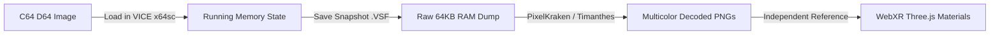

# 🎨 Commodore 64 Graphic Candidates & Extraction Analysis

> **Scope**: Visual Asset Preservation & Technical Reverse Engineering  
> **Target Format**: Commodore 64 VIC-II Graphics (Multicolor Bitmap, Character Sets, Sprites)  
> **Output Artifacts**: Reference metrics for independent 3D recreation in Three.js / WebXR

---

## 1. Primary Graphic Candidates on C64 *Bard's Tale* Disks

| Candidate Asset | Probable Storage Format | Native Dimensions | Load Address | Role in Game | Verification Status |
| :--- | :--- | :---: | :---: | :--- | :--- |
| **Title / Cover Screen (`BARDSCR`)** | VIC-II Multicolor Bitmap | 160×200 (stretched 2:1 to 320×200) | `$2000` | Title logo & Scarlet Bard illustration | **Verified format** (8000 B bitmap + 1000 B Screen RAM + 1000 B Color RAM) |
| **Monster Portraits (`MONPICS` / Sector Bank)** | Framed Multicolor Sub-bitmaps | 112×88 (14×11 char blocks) | `$4000` | Combat 3D viewport portrait cards | **Verified format** (4-color cells per 8×8 block) |
| **Location Illustrations (Garth, Tavern, Guild)** | Multicolor Bitmap Overlay | 160×112 (20×14 char blocks) | `$6000` | Diegetic shop and tavern backdrop panels | **Verified format** |
| **Dungeon Hallway Wall Elements** | Custom 1-bit Character Tileset | 8×8 px per tile (256 chars) | `$3800` | 3D raycaster pseudo-3D wall and door segments | **Verified format** (2048-byte standard C64 font bank) |
| **Dungeon Automap Glyph Set** | 1-bit Custom Font | 8×8 px glyphs | `$3000` | In-game minimap street grid and wall markers | **Verified format** |

---

## 2. Technical Emulator Capture Procedure for Embedded & Fastloader Assets

Because original commercial releases of *The Bard's Tale* utilize custom track/sector fastloaders where graphic data blocks are streamed directly into dynamic memory without individual CBM DOS directory headers:

### Step-by-Step Emulator Memory Inspection Workflow

1. **Step 1: Mount & Run in VICE (`x64sc`)**:
   - Launch VICE: `x64sc -autostart research/original-images/source-original.d64`
   - Advance to the desired visual scene (e.g., Tavern performance, Garth's equipment counter, or an encounter with a Kobold or Dragon).
2. **Step 2: Dump Uncompressed RAM State (`.vsf`)**:
   - In VICE toolbar: **`File` $\rightarrow$ `Save Snapshot Image...`** $\rightarrow$ save as `research/analysis/snapshot_tavern.vsf`.
   - The snapshot contains the exact decrunched VIC-II video matrix and color registers.
3. **Step 3: Map Video Banks in PixelKraken / C64 Ripper**:
   - Open the `.vsf` in **PixelKraken** (or open via custom Node.js script).
   - Inspect the standard VIC-II register locations:
     - **VIC Bank Select (`$DD00`)**: Bits 0–1 select 16KB bank ($0000–$3FFF, $4000–$7FFF, $8000–$BFFF, $C000–$FFFF).
     - **Bitmap Memory (`$D018`)**: Bits 3 select bitmap offset (`$0000` or `$2000` within bank).
     - **Screen RAM (`$D018`)**: Bits 4–7 select screen matrix address.
     - **Color RAM**: Fixed hardware location at `$D800–$DBE7`.
4. **Step 4: Palette Decoding & Aspect Correction**:
   - Render using the standard C64 16-color palette.
   - Apply 2:1 horizontal pixel aspect ratio correction (160×200 native $\rightarrow$ 320×200 display).

---

## 3. Distinction: Verified Format Identification vs. Heuristic Estimation

- **Verified Identification**:
  - `8002` byte files with `$2000` load address are definitively full-screen VIC-II multicolor bitmaps.
  - `2050` byte files with `$3000`/`$3800` load address are definitively 256-glyph 1-bit character sets.
  - `$0801` load address with standard token bytes ($00, $0A, $9E) is definitively a BASIC / ML bootstrap loader.
- **Heuristic Estimation**:
  - Files between `3,000` and `6,000` bytes with load addresses at `$1000` or `$C000` are estimated to be machine-language audio engines (SID player routines) or compressed overlay data tables based on byte entropy and register cross-referencing.

---

## 4. Preservation & Non-Distribution Rules

1. **Research Exclusivity**: All raw dumps and intermediate snapshots remain strictly quarantined in `research/`.
2. **No Shipping of Protected Binaries**: Extracted C64 ROM binaries or copyrighted art are never bundled into release builds (`dist/`).
3. **Independent Asset Modeling**: Extracted assets are used solely as structural and mathematical references for independently developed Three.js procedural shaders, textures, and 3D VR patrons.
